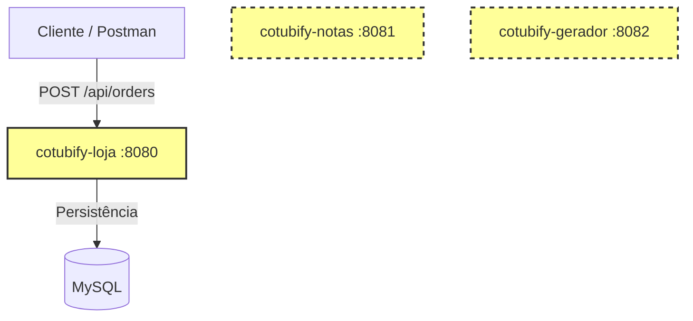
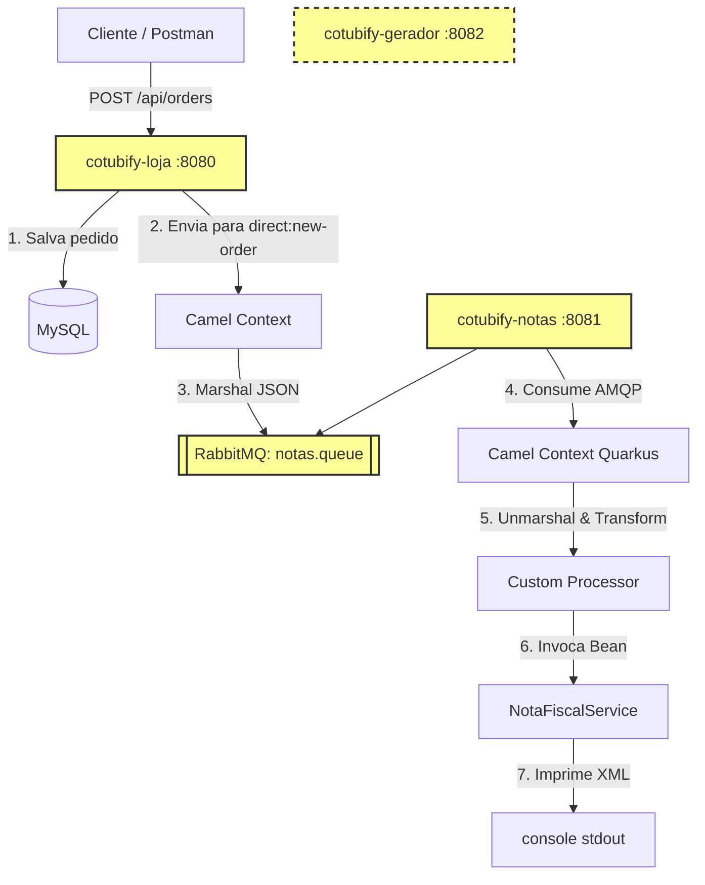

# 🖥️ Live UniPDS - Introdução ao Apache Camel

Este projeto foi desenvolvido para a Live de Introdução ao **Apache Camel** na pós-graduação **Java + IA** da **UniPDS**. 

O objetivo prático é integrar três microserviços independentes de uma loja online de Ebooks chamada **Cotubify**, evoluindo de uma arquitetura com sistemas isolados para uma arquitetura orientada a eventos usando **RabbitMQ** e o framework de integração **Apache Camel** (com abordagens tanto em **Spring Boot** quanto em **Quarkus**).

---

## 🏗️ Arquitetura

O sistema é composto por 3 aplicações distintas que representam o ecossistema da loja **Cotubify**:

1. **`cotubify-loja`** (Porta `8080`): API em Spring Boot para consulta de catálogo e recepção de pedidos. Persiste as informações em um banco MySQL.
2. **`cotubify-notas`** (Porta `8081`): Serviço em Quarkus responsável por receber os dados de um pedido e simular a geração de uma Nota Fiscal eletrônica em formato XML.
3. **`cotubify-gerador`** (Porta `8082`): API em Spring Boot que simula o pipeline de compilação do Ebook (geração dos arquivos `.pdf` e `.epub` a partir de uma fonte Markdown em repositório Git).

Os sistemas estão isolados. O pedido é feito na loja e persistido no banco de dados, mas as notas fiscais não são geradas automaticamente e os ebooks não são compilados.



## 🛠️ Tecnologias e Versões Utilizadas

| Componente | Framework / Core | Versão | Java | Principais Bibliotecas & Starters Camel |
| :--- | :--- | :--- | :--- | :--- |
| **`cotubify-loja`** | Spring Boot | `4.1.0` | `25` | `camel-spring-boot-starter`<br>`camel-spring-rabbitmq-starter`<br>`camel-jackson-starter`<br>`spring-boot-starter-amqp` |
| **`cotubify-notas`** | Quarkus | `3.36.3` | `25` | `camel-quarkus-amqp`<br>`camel-quarkus-jackson` |
| **`cotubify-gerador`**| Spring Boot | `4.1.0` | `25` | *(Integrado opcionalmente como desafio)* |
| **MySQL (Docker)** | MySQL | `9.0` | N/A | Banco de dados relacional da loja |
| **RabbitMQ (Docker)**| RabbitMQ | `4.2` | N/A | Broker de mensageria |

---

## 📂 Estrutura e Classes de Domínio

### 🛒 `cotubify-loja` (Spring Boot)
Gerencia o banco de dados via JPA/Hibernate e inicializa os dados usando Flyway.
- **Entidades de Banco (`br.com.unipds.cotubify.loja.entity`):**
  - [Ebook.java](file:///Users/alexandreaquiles/Documents/unipds/projetos-lives/live-apache-camel/cotubify-loja/src/main/java/br/com/unipds/cotubify/loja/entity/Ebook.java): Contém título, preço, ISBN, e a URL do repositório Git de origem.
  - [Author.java](file:///Users/alexandreaquiles/Documents/unipds/projetos-lives/live-apache-camel/cotubify-loja/src/main/java/br/com/unipds/cotubify/loja/entity/Author.java): Dados do autor (Nome, mini-bio).
  - [Order.java](file:///Users/alexandreaquiles/Documents/unipds/projetos-lives/live-apache-camel/cotubify-loja/src/main/java/br/com/unipds/cotubify/loja/entity/Order.java): Pedido mapeado contendo cliente, CPF, e endereço.
  - [OrderItem.java](file:///Users/alexandreaquiles/Documents/unipds/projetos-lives/live-apache-camel/cotubify-loja/src/main/java/br/com/unipds/cotubify/loja/entity/OrderItem.java): Itens comprados, preço histórico de venda e desconto aplicado.
- **DTOs (`br.com.unipds.cotubify.loja.dto`):**
  - `OrderRequestDTO` e `OrderItemRequestDTO`.

### 🧾 `cotubify-notas` (Quarkus)
Serviço simples que opera como gerador de Nota Fiscal.
- **DTOs de Entrada (`br.com.unipds.cotubify.notas.dto`):**
  - [PedidoDTO.java](file:///Users/alexandreaquiles/Documents/unipds/projetos-lives/live-apache-camel/cotubify-notas/src/main/java/br/com/unipds/cotubify/notas/dto/PedidoDTO.java): Modelo simplificado contendo ID do pedido, dados do cliente e lista de itens.
  - [ItemPedidoDTO.java](file:///Users/alexandreaquiles/Documents/unipds/projetos-lives/live-apache-camel/cotubify-notas/src/main/java/br/com/unipds/cotubify/notas/dto/ItemPedidoDTO.java): Itens com o preço de compra e desconto.
- **Serviço:**
  - [NotaFiscalService.java](file:///Users/alexandreaquiles/Documents/unipds/projetos-lives/live-apache-camel/cotubify-notas/src/main/java/br/com/unipds/cotubify/notas/service/NotaFiscalService.java): Calcula o valor total líquido (Preço - Desconto), monta um payload XML e faz a saída no console.

### ⚙️ `cotubify-gerador` (Spring Boot)
API REST que simula a pipeline de criação de arquivos físicos `.pdf` e `.epub`.
- **DTOs de Entrada (`br.com.unipds.cotubify.gerador.dto`):**
  - [GeracaoEbookRequest.java](file:///Users/alexandreaquiles/Documents/unipds/projetos-lives/live-apache-camel/cotubify-gerador/src/main/java/br/com/unipds/cotubify/gerador/dto/GeracaoEbookRequest.java): ID do pedido, cliente, título do ebook e a URL Git a ser clonada.
- **Serviço:**
  - [GeradorEbookService.java](file:///Users/alexandreaquiles/Documents/unipds/projetos-lives/live-apache-camel/cotubify-gerador/src/main/java/br/com/unipds/cotubify/gerador/service/GeradorEbookService.java): Imprime no console o progresso de geração do ebook.

---

## ⚡ Como Executar o Projeto

### Passo 1: Subir a Infraestrutura (Docker)
Na pasta raiz e inicie os containers do MySQL e RabbitMQ:
```bash
docker compose up -d
```
> [!NOTE]
> * **RabbitMQ UI:** acesse em `http://localhost:15672` (Usuário: `admin` / Senha: `senha123`).
> * **MySQL:** exposto na porta `3306` (Usuário: `admin` / Senha: `senha123`, Banco de dados: `cotubify`).

### Passo 2: Rodar os Microserviços
Execute cada um dos projetos em terminais separados usando os comandos de desenvolvimento:

* **Cotubify Loja (Spring Boot):**
  ```bash
  cd cotubify-loja
  ./mvnw spring-boot:run
  ```
  *(Porta padrão: `8080`)*

* **Cotubify Notas (Quarkus):**
  ```bash
  cd cotubify-notas
  ./mvnw quarkus:dev
  ```
  *(Porta padrão: `8081`)*

* **Cotubify Gerador (Spring Boot):**
  ```bash
  cd cotubify-gerador
  ./mvnw spring-boot:run
  ```
  *(Porta padrão: `8082`)*

---

## 🔌 Exemplos de Requisições das APIs (REST)

Cada microserviço contém sua respectiva collection do Postman na raiz do seu diretório. Abaixo estão os exemplos formatados para testes rápidos via `curl`:

### 🛒 1. Cotubify Loja (Porta 8080)
#### Listar Ebooks Cadastrados (GET)
```bash
curl -X GET http://localhost:8080/api/ebooks
```
**Resposta esperada (JSON):**
```json
[
  {
    "id": 1,
    "title": "Enterprise Integration Patterns",
    "description": "O livro definitivo sobre padrões de integração de sistemas corporativos.",
    "price": 249.90,
    "gitRepoUrl": "git@github.com:cotubify-internal/eip-book.git",
    "authors": ["Gregor Hohpe", "Bobby Woolf"]
  },
  {
    "id": 2,
    "title": "Refactoring",
    "description": "Melhorando o design de códigos existentes de forma segura e pragmática.",
    "price": 199.90,
    "gitRepoUrl": "git@github.com:cotubify-internal/refactoring-book.git",
    "authors": ["Martin Fowler"]
  }
]
```

#### Criar Novo Pedido (POST)
```bash
curl -X POST http://localhost:8080/api/orders \
-H "Content-Type: application/json" \
-d '{
    "clientName": "Giovana Daiane Simone Ribeiro",
    "cpf": "408.339.952-00",
    "email": "giovana.daiane.ribeiro@fictor.com.br",
    "address": "Avenida Tailândia, 681, Cabralzinho, Macapá / AP",
    "items": [
        { "ebookId": 1, "discount": 50.0 },
        { "ebookId": 2, "discount": 0.0 }
    ]
}'
```

---

### 🧾 2. Cotubify Notas (Porta 8081)
#### Simular Nota Fiscal Manualmente (POST)
```bash
curl -X POST http://localhost:8081/api/notas \
-H "Content-Type: application/json" \
-d '{
  "id": 101,
  "nomeCliente": "João Silva",
  "cpfCliente": "111.222.333-44",
  "enderecoCliente": "Rua das Flores, 123",
  "dataCriacao": "2026-06-23T14:30:00",
  "itens": [
    {
      "ebookId": 1,
      "tituloEbook": "Enterprise Integration Patterns",
      "precoCompra": 250.00,
      "desconto": 50.00
    }
  ]
}'
```
**Resposta esperada (XML):**
```xml
<notaFiscal>
  <pedidoId>101</pedidoId>
  <cliente>
    <nome>João Silva</nome>
    <cpf>111.222.333-44</cpf>
  </cliente>
  <valorTotal>200.00</valorTotal>
  <descricao>
    - Enterprise Integration Patterns (1)
  </descricao>
</notaFiscal>
```

---

### ⚙️ 3. Cotubify Gerador (Porta 8082)
#### Acionar Geração de Ebook Manualmente (POST)
```bash
curl -X POST http://localhost:8082/api/gerador \
-H "Content-Type: application/json" \
-d '{
  "pedidoId": 101,
  "nomeCliente": "João Silva",
  "cpfCliente": "111.222.333-44",
  "ebookId": 1,
  "tituloEbook": "Enterprise Integration Patterns",
  "urlRepositorioGit": "git@github.com:cotubify-internal/eip-book.git"
}'
```

---

## 🎯 Objetivo

A integração assíncrona é estabelecida entre a **Loja** e o gerador de **Notas**. A loja publica o evento de pedido criado no RabbitMQ, e o serviço de notas fiscais consome e processa o XML correspondente.



---

## 🔀 Detalhes da Integração Camel

O fluxo integrado funciona da seguinte forma:

### 1. Produtor: `cotubify-loja`
* **Controller:** No [OrderController.java](file:///Users/alexandreaquiles/Documents/unipds/projetos-lives/live-apache-camel/cotubify-loja/src/main/java/br/com/unipds/cotubify/loja/controller/OrderController.java), a dependência `ProducerTemplate camelTemplate` do Apache Camel é injetada. Após salvar o pedido no banco, o payload da entidade `Order` persistida é enviado para o canal interno do Camel:
  ```java
  Order savedOrder = orderRepository.save(order);
  camelTemplate.sendBody("direct:new-order", savedOrder);
  ```
* **Rota Camel:** No [OrderRoute.java](file:///Users/alexandreaquiles/Documents/unipds/projetos-lives/live-apache-camel/cotubify-loja/src/main/java/br/com/unipds/cotubify/loja/integration/OrderRoute.java), a rota intercepta o pedido, serializa a entidade JPA em JSON usando **Jackson** e envia para a exchange do RabbitMQ:
  ```java
  from("direct:new-order")
      .routeId("rota-loja-para-rabbitmq")
      .marshal().json(JsonLibrary.Jackson)
      .to("spring-rabbitmq:cotubify.exchange?routingKey=notas&queues=notas.queue&autoDeclareProducer=true");
  ```

### 2. Consumidor: `cotubify-notas`
* **Configuração:** O arquivo de propriedades injeta a conexão AMQP no Broker de Mensagens.
* **Rota Camel:** No [NotaFiscalRoute.java](file:///Users/alexandreaquiles/Documents/unipds/projetos-lives/live-apache-camel/cotubify-notas/src/main/java/br/com/unipds/cotubify/notas/integration/NotaFiscalRoute.java), o Camel Quarkus consome as mensagens da fila usando AMQP 1.0, realiza a desserialização do JSON para `JsonNode` e executa uma **tradução estrutural de dados** (Pattern *Message Translator*) antes de repassar os dados limpos ao `NotaFiscalService`:
  ```java
  from("amqp:queue:notas.queue")
      .unmarshal(new JacksonDataFormat(JsonNode.class))
      .process(exchange -> {
          // Extração do JSON recebido da loja e mapeamento para o PedidoDTO do Quarkus...
      })
      .bean(notaFiscalService, "gerarNotaFiscal");
  ```

---

## 📽️ Conteúdo Abordado

A Live de Introdução ao Apache Camel será estruturada para cobrir desde a fundação conceitual até a aplicação prática em arquitetura de microsserviços.

1. **Introdução Teórica aos Padrões de Integração Corporativa (EIPs)**
   * O que é o Apache Camel e por que ele é considerado o "canivete suíço" da integração de sistemas?
   * Os conceitos fundamentais: `CamelContext`, `Routes` (Rotas), `Endpoints`, `DSL` (Java/XML/YAML) e `Components`.
2. **Explorando a Loja Cotubify**
   * Análise do estado inicial (Branch `main`).
   * Inicialização da infraestrutura do Docker (MySQL + RabbitMQ).
3. **Mão na Massa: O Lado Produtor (Spring Boot + Camel)**
   * Adicionando as dependências do Camel Spring Boot.
   * Utilizando o `ProducerTemplate` no controller da loja.
   * Criando uma rota (`RouteBuilder`) para formatar e publicar em filas RabbitMQ.
4. **Mão na Massa: O Lado Consumidor (Quarkus + Camel)**
   * Entendendo o ecossistema Quarkus Extension para Camel.
   * Criando a rota de consumo de fila via AMQP 1.0.
   * **Message Transformation:** Mapeando as discrepâncias de formato entre a Loja (Spring) e o Notas (Quarkus) usando Camel DSL e `Processor`.
5. **Simulação Completa do Fluxo**
   * Enviar requisição para a loja, verificar o log de publicação, checar o console do RabbitMQ e visualizar a nota fiscal gerada em tempo real no console do Quarkus.

### 🏆 Próximos Passos
Integrar o terceiro microsserviço (**`cotubify-gerador`**):
* **Cenário:** O compilador de Ebooks também deve receber os dados do pedido de forma assíncrona assim que uma venda for concluída para iniciar a compilação do PDF/EPUB.
* **Implementação:** Configurar o Camel no `cotubify-gerador` e alterar a rota da Loja para enviar a mensagem para ambos os destinos (usando padrões como **Publish-Subscribe** no RabbitMQ / Camel). Deve ser feito o Message Splitter e um Message Translator para adequar a estrutura do gerador.
